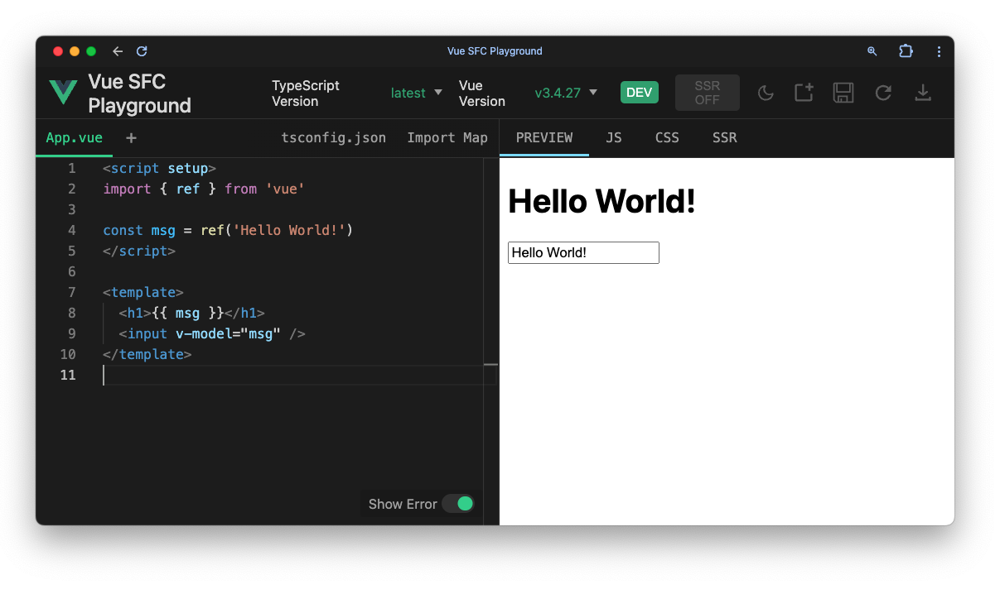

# VUE JS Playground

Modified version of the original Vue.js playground found at [https://play.vuejs.org](https://play.vuejs.org).

This version doesn't use hashes to save the state of the app and allows you to save playgrounds by name.

It is also more docker and webapp friendly: `docker pull mcnull/vue-playground:latest`. Image is very small (4mb).

